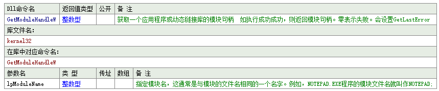
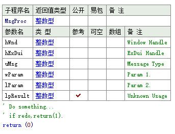
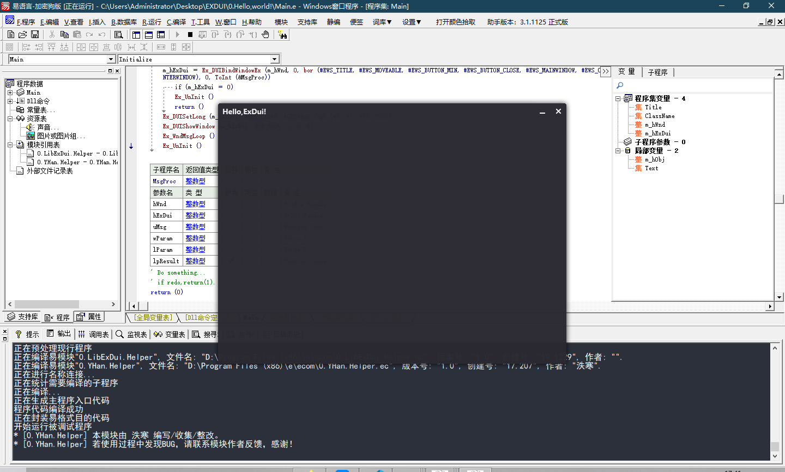

# At the Beginning...
由于近期爱好摸鱼，并且对Gui开发萌生一丝兴趣。在尝试WPF被虐，使用Qt却不太喜欢整套庞大的框架后……  
I choose E language!  
重拾了小学用的工具……  

据我所知，易语言的Gui除了native E之外，主要是Ex_Ui和ExDui两家，而Ex_Ui由于高度封装，相对效率低一些，而逼格可能不如ExDui。  
并且ExDui似乎有多语言支持，通用性更好。

于是选择了**EXDUI**，开始学习……

# Install  
安装的话，去[官方论坛](https://bbs.exdui.org/)下载即可，提供了2个模块，大概是封装了dll函数。  
核心应该是Lib_ExDui_Helper。

推荐加入官方群，有一些资源以后或许会用到。

# Coding

使用`_启动子程序`的方式进行启动，使用黑月3.6.6进行编译，运行易语言核心库。  
在群内下载了窗口创建Demo，开始看源码学习……(官方包中也有带Demo)。  
发现必须使用主题包，而官方文档显示ThemeMaker仍在开发中，对主题包如何制作实在是疑惑。后在群文件中发现了主题打包器。  
这里直接使用Demo中自带的default主题。  

## LoadTheme

主题包可以作为独立外置文件，也可以作为res资源文件内嵌在程序中。这里使用外置的写法，将主题包`default.ext`放在同目录下，写代码：
```
Bin(即字节集) Theme = ReadFile("default.ext");
```
由于不了解主题变量调用机制，声明为全局变量。

## InitEngine

初始化ExDui引擎，查官方文档查到：
```cpp
bool __stdcall 
Ex_Init (
    HINSTANCE hInstance,
    DWORD     dwGlobalFlags,
    HCURSOR   hDefaultCursor,
    LPCTSTR   lpszDefaultClassName,
    LPVOID    lpDefaultTheme,
    DWORD     dwDefaultThemeLen,
    LPVOID    lpDefaultI18N,
    DWORD     dwDefaultI18NLen
);
```
```
hInstance
Type: HINSTANCE
动态库(DLL)的实例句柄 可为NULL

dwGlobalFlags
Type: DWORD
全局初始化标识 参见 EXGF​

hDefaultCursor
Type: HCURSOR
默认鼠标指针句柄 可为NULL

lpszDefaultClassName
Type: LPCTSTR
默认窗口类名 可为NULL

lpDefaultTheme
Type: LPVOID
默认主题包指针

dwDefaultThemeLen
Type: DWORD
默认主题包缓冲区长度

lpDefaultI18N
Type: LPVOID
默认语言包指针

dwDefaultI18NLen
Type: DWORD
默认语言包指针缓冲区长度

Return Value / 返回值
Type: BOOL
初始化引擎
```
令我比较迷茫的是第一个参数，动态库的实例句柄，发现Demo中使用了`GetModuleHandleW`的API，查了查MSDN，得知是以名称获取模块句柄的API。

Demo中如此使用：
```
GetModuleHandleW(0)；
```
参数为0(其实应该是代表NULL)时返回调用者模块的句柄。
易语言Dll声明如下：


第二个参数是初始化标识，查到官方文档：
[Click](https://docs.exdui.org/exdirectui/chang-liang/exgf)
注意的是，如果有多个标识符，使用`或运算`来合并。  
第三个第四个参数无特殊需要直接为0即可，默认主题包指针则传入`theme`变量的地址。  
对易语言中取得地址的操作有些疑问，发现YHan.Helper已经封装了相关函数，使用了机器码……  
主题包长度则直接取字节集长度即可。  
不使用语言包，后两个参数也写NULL。  

Init返回True的话，就是初始化成功了。
## Make My Window

### Set Properties
随后想想设置窗口的属性。  
标题等设置似乎都要提供指针，因此YHanHelper的确是至关重要啊……
发现Demo中使用了A2W函数，Google查后发现是转宽字符的函数，大概是为了支持中文。
```
A2W, Ansi to w_char?仅个人猜测。
```
这个函数我也不熟悉。  
声明字节集型的变量，作为Title和ClassName：
```
Bin Title = A2W("Hello,ExDui!"),ClassName = A2W("Demo");
```

### Register ClassName
随后需要注册窗口类名，这个原因同样令我疑惑，上网查到了一位网友的回答：
>关于窗口类
>每一个窗口对应一个窗口过程，而该窗口过程是被所有使用这个窗口类的窗口所共享的。每一个进程在要创建窗口之前，必须要先注册改窗口所属的窗口类。注册窗口类就是将窗口过程，窗口风格以及其他窗口属性用一个类名相关连起来。当进程在CreateWindow, CreateWindowEx中使用窗口类名时，所创建的窗口属性就和窗口类中的各属性相联系了。 
大概可以理解为注册窗口类模板，而显示的窗口是实例。感性理解一下，具体我也并不明白，或有理解错误。  
使用此API:[Click](https://docs.exdui.org/exdirectui/function/window/ex_wndregisterclass)
如果图标、鼠标等不打算特殊设置大概都可以写NULL?

### Create Window
注册好窗口类名之后，可以用该类名来创建一个窗口实例。
应该调用的是Windows API，封装在ExDui的lib中了，返回Windows窗口句柄。
ExDui的文档：[Click](https://docs.exdui.org/exdirectui/function/window/ex_wndcreate)
用整数型保存下来。  
随后使用ExDui引擎托管窗口，使用API：
```
int Ex_DuiBindWindowEx(int hWnd,int hTheme,int dwStyle,int lParam,int lpfnMsgProc);
//Ex_DuiBindWindow(int hWnd,int hTheme,int dwStyle);
```
这个API在官方的文档中查不到，应该是文档还不完善，看起来dwStyle的参数跟上面的windows API重复了，Demo中是直接使用这个函数设置的dwStyle，猜测应该是ExDui会自行实现dwStyle。
lParam用途为止，写NULL。
lpfnMsgProc是绑定消息循环的函数地址用的，先声明一个空子程序，到整数转成整数型绑上去。
常量是一样的。
返回引擎句柄，也用整数型保存。
用这个句柄可以访问引擎，比如`Ex_DuiGetLong`之类的看起来像是访问成员变量的API等。
我们给窗口设置一个背景颜色：
```
Ex_DUISetLong (m_hExDui, #EWL_CRBKG, RGB2ARGB (rgb (42, 41, 49), 250))
```
### MsgProc
消息循环类似于这样：
```
while(true)
    MsgProc();
```
也就是说，会一直占用线程直到窗口被关闭。
消息循环应该也是Windows API中的，ExDui要求的函数如下：

其实返回值的用处我还没查清楚，以后再测测吧。
## Final
写完之后，按下F5，一个窗口就出现了！

程序体积方面，用了黑月汇编模式编译仅14kb，而ExDui的dll 700kb，体积还是比较小巧的。
# Src
[Lanzous下载](https://www.lanzous.com/i8os80d)