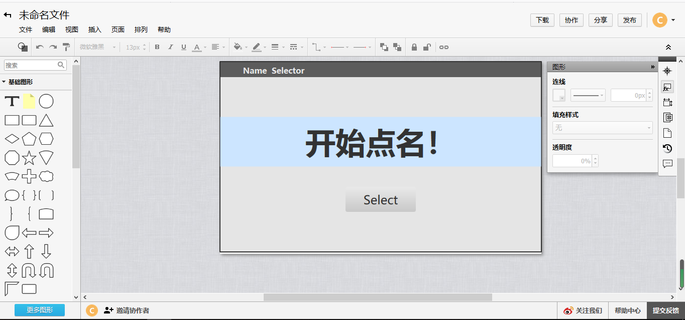
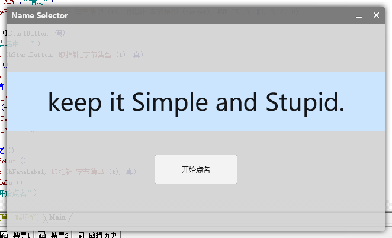

# 咕咕咕
尝试自己写组件对象被易语言的对象劝退后，我又回来写教程了。  
相信上一章对如何创建窗口讲得足够透彻了，这一章上项目实战：点名器。  
~~点名器这种简单的东西实在是经常被拿出来开刀啊。~~

# Design
在打代码之前，我们必须要清楚界面布局。  
一个点名器是怎么样的?  

1. 显示名称的标签。(NameLabel)  
2. 开始点名的按钮。(StartButton)  

Easy enough，right？  
画个界面图方便打代码，最好使用一些方便的工具。当时我选择的是**ProcessOn**，但的确算不上好用……  
不过位置能画出来就好了，其他的随缘。  


# Coding
显示窗口就不赘述了，可以看[我之前的教程](https://www.cnblogs.com/Clouder-Blog/p/ExDuiTuturial0.html)。  
随后往窗口上加控件。  

## NameLabel  
并没有Label之类的控件……我查了好久Demo，才发现一个Static比较像。  
Static是windows下显示静态文本的控件。显示文本嘛，当成Label就好了。  
使用[Ex_ObjCreateEx](https://docs.exdui.org/exdirectui/function/component/ex_objcreateex)来创建组件对象。  
其中`hParent`填写ExDui的句柄，其他没啥特殊的。  
为了显示效果，将Text_Format设置为纵向横向居中。  
最终代码大概是这样：
```
hNameLabel ＝ Ex_ObjCreateEx (-1, 取指针_字节集型 (temp1), 取指针_字节集型 (temp2), -1, 0, 110, 640, 100, hExDui, 0, 位或 (#DT_VCENTER, #DT_CENTER), 0, 0, 0)
```
设置下背景颜色啊，字体啊，代码如下：
```
Ex_ObjSetColor (hNameLabel, #COLOR_EX_BACKGROUND, RGB2ARGB (取颜色值 (204, 229, 255), 255), 假)
Ex_ObjSetFont (hNameLabel, _font_createfromfamily (取指针_字节集型 (temp3), 40, -1), 假)
```
其中文本为：
```
temp1 ＝ A2W (“Static”, )
temp2 ＝ A2W (“keep it Simple and Stupid.”, )
temp3 ＝ A2W (“微软雅黑”, )
```
NameLabel没什么需要绑定的事件，创建好放在那里就行了。
## StartButton
所有控件统一视为Object，所以还是按部就班地创建一个obj。
```
temp1 ＝ A2W (“Button”, )
temp2 ＝ A2W (“开始点名”, )
hStartButton ＝ Ex_ObjCreate (取指针_字节集型 (temp1), 取指针_字节集型 (temp2), -1, 250, 250, 140, 50, hExDui)
```
按钮要绑定事件处理点击，用`ObjHandleEvent`来绑定。
```
Ex_ObjHandleEvent (hStartButton, #NM_CLICK, 到整数 (&onStartButtonClicked))
```
随后`ShowWindow`，开始消息循环即可。

## Do Things 
界面画好了，开始处理业务逻辑吧。  
点名器的话，大概如下流程：

0. 读入名单。
1. 点击StartButton。
2. NameLabel显示一个名字。

在StartButton被单击的事件中添加处理代码即可，具体实现相信大家都会，主要用到该API：
```
Ex_ObjSetText()
```
如果直接转换太生硬了，还可以加一点动画，淡入淡出随机显示几个后再显示目标名字等等，这里不细讲了。

## Title
最后讲一下标题栏的处理。标题栏也是一个Object，但获取句柄需要用到特殊的方法：
```
hTitle ＝ Ex_ObjGetFromID (hExDui, #EWS_TITLE)
```
随后可以拿着句柄操作标题栏了。

# Final
最终效果如下：

简单而中规中矩，毕竟一共也就3个控件，代码实现还是比较简单的。  
[Download Src](https://www.lanzous.com/i8uff8b)